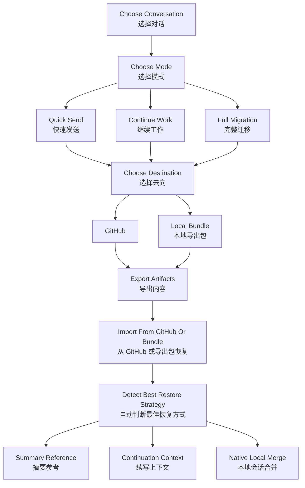

# codex-session-sync

Sync Codex local session history across devices with GitHub or local export bundles.

通过 GitHub 或本地导出包，在不同设备之间同步 Codex 本地会话记录。

## Logic Diagram | 逻辑图



## Plain-Language Overview | 通俗介绍

This skill is designed to feel closer to code sync than manual export/import.

- Pick the conversation you want to carry.
- Pick how much fidelity you need.
- Pick whether it should go to GitHub or a local bundle.
- Restore it on another machine with the safest merge strategy available.

这个 skill 的目标，是让用户感觉自己在“同步工作进度”，而不是手动搬运会话文件。

- 先选你想带走的那段对话。
- 再选你需要保留多少上下文。
- 再选发送到 GitHub，还是导出成本地包。
- 在另一台设备恢复时，系统会尽量自动选择最安全的恢复方式。

In most cases, `继续工作（推荐）` is the best default because it preserves enough context for high-quality continuation without forcing a raw local-session merge.

大多数情况下，`继续工作（推荐）` 是最合适的默认项，因为它能保留足够多的上下文来保证跨设备续写质量，同时又不强制做 raw 本地会话合并。

## What It Does | 能做什么

- Lets users choose a conversation by title and recency
- Offers three product-style export modes:
  - `快速发送`
  - `继续工作（推荐）`
  - `完整迁移`
- Supports two export destinations:
  - GitHub
  - Local zip bundle
- Supports two import sources:
  - GitHub
  - Local zip bundle
- Preserves first-user-message titles even in lightweight exports
- Attempts low-risk local merge matching on import

它支持的核心能力包括：

- 按标题和最近时间选择对话
- 提供三种产品化的导出模式
- 支持 GitHub 和本地导出包两种导出方式
- 支持 GitHub 和本地导出包两种导入方式
- 即使是轻量导出，也保留第一句用户消息作为标题锚点
- 导入时尽量做低风险自动匹配，而不是贸然硬合并

## Skill Contents | 技能内容

- `SKILL.md`
- `scripts/`
- `references/`

## Installation | 安装方式

Copy the folder into your Codex skills directory:

```bash
cp -R codex-session-sync ~/.codex/skills/
```

Or symlink it during development:

```bash
ln -s /absolute/path/to/codex-session-sync ~/.codex/skills/codex-session-sync
```

## Recommended Usage | 推荐用法

Use `继续工作（推荐）` for most cross-device workflows.

Use `完整迁移` only when you want the closest thing to native local-session restoration and are comfortable with the higher privacy exposure of raw session files.

对于大多数跨设备续写场景，优先使用 `继续工作（推荐）`。

只有当你确实希望尽量接近本地原生会话恢复，并且能接受 raw 文件更高的隐私暴露风险时，才建议使用 `完整迁移`。

## Publishing Notes | 发布注意事项

- Prefer a private sync repository when storing real user session content.
- Review the exported summaries before sharing publicly.
- Raw exports may include more metadata than users expect.
- Do not publish real exported session examples from private workspaces.
- Keep the skill repo separate from the user's real sync repo.

发布时建议注意：

- 真正存放用户会话内容的同步仓库，最好使用私有仓库
- 对外发布前，先检查摘要内容里没有误带私人信息
- raw 导出可能包含比用户预期更多的上下文元信息
- 不要把真实工作区导出的会话样例公开发布
- skill 仓库和实际同步仓库最好分离

## Validation | 校验

```bash
python3 ~/.codex/skills/.system/skill-creator/scripts/quick_validate.py codex-session-sync
```
